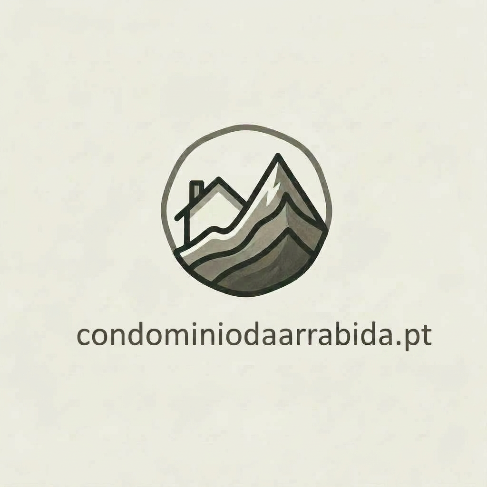

<!Doctype HTLM>
<html lang="pt">
<head>
<meta charset="UTF-8">
<meta name="viewport" content="width=device-width, initial-scale=1.0">
<title>Condomínio da Arrábida</title>

</head>

<body>

<header>
    

        
        

            <h1>Condomínio da Arrábida</h1>
            
www.condominiodaarrabida.pt

        

    

</header>

    

        <h2>Os Nossos Serviços</h2>
        <ul>
            <li>Preços ajustados a cada edifício</li>
            <li>Administração de condomínios com Gestão Certificada</li>
            <li>Reuniões híbridas (presencial e virtual)</li>
            <li>Support to English, French and Spanish speakers</li>
            <li>Margem Sul e Vale do Tejo</li>
            <li>Apoio tecnológico a condóminos com +50 anos</li>
            <li>Apoio em língua inglesa e francesa</li>
        </ul>
    

    

        <h2>Contactos</h2>
        
<strong>Telefone:</strong> 961 922 058

        
<strong>Email:</strong> condominiodaarrabida@gmail.com

    

<footer>
    © 2026 Condomínio da Arrábida
</footer>

</body>
</html>
